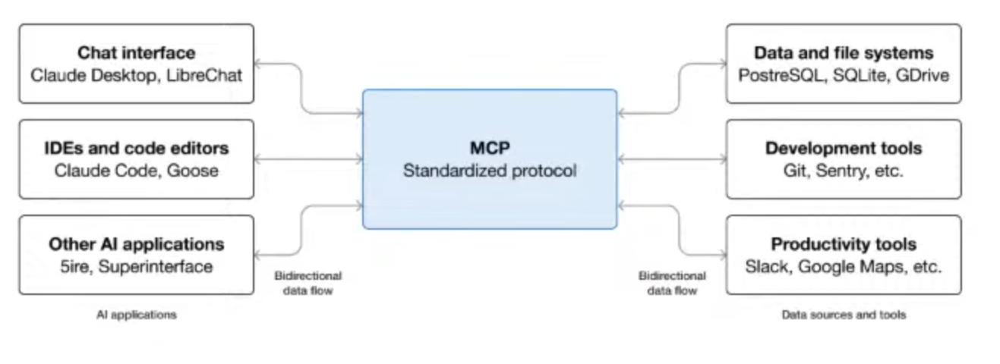
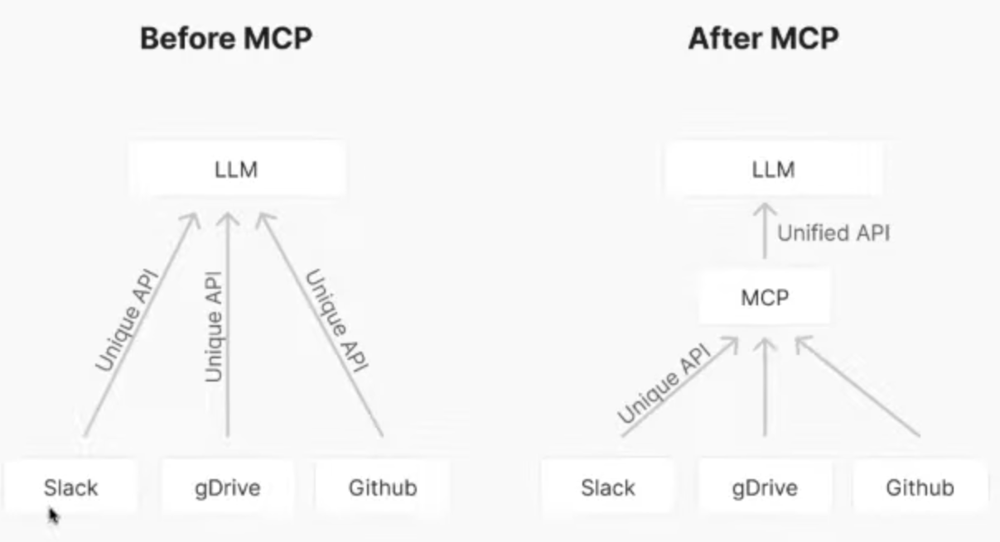
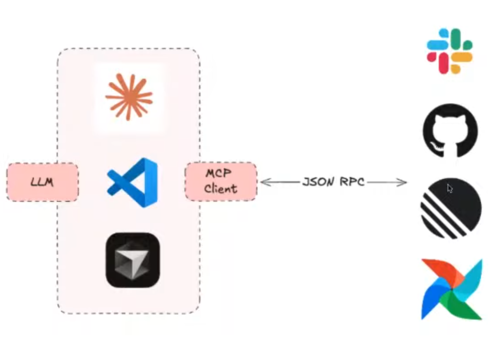
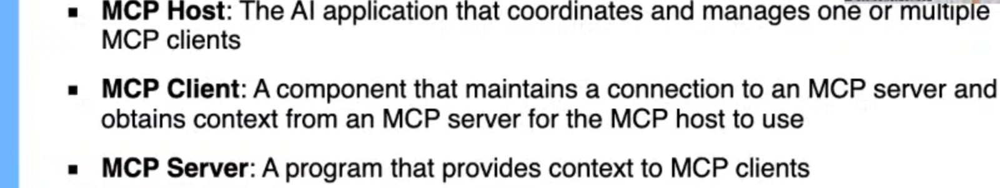
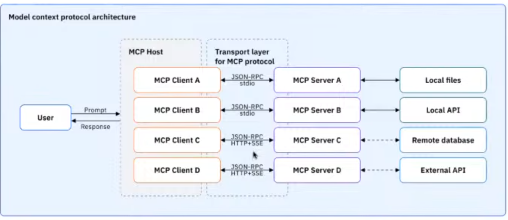

# **Model Context Protocol (MCP): Architecture, Servers, Workflows Automation | Step-by-Step Tutorial**

- Workshop Video: https://www.youtube.com/watch?v=0IhZdcjddo4&list=PL3MmuxUbc_hLuyafXPyhTdbF4s_uNhc43
- Workshop Repository: https://github.com/thelearningdev/mcp-ai-dev-workflow

The model context protocol (MCP) is an open standard that enables developers to build secure, two-way connections between their data sources and AI-powered tools. - Anthropic

Before MCP developers should write their own unique API to connect each tool needed.

## MCP Architecture

* MCP Host

* MCP Client

* MCP Server

  

## MCP Primitives

* Notifications
* Server
  * Tools
  * Resources
  * Prompts
* Client
  * Sampling 
  * Roots
  * Elicitation
